# Wireshark-Network-Forensics

* **$$\color{red}{\text{Page-1: Capture devices}}$$**

  * Open **==>** <code>Wireshark</code>
  
    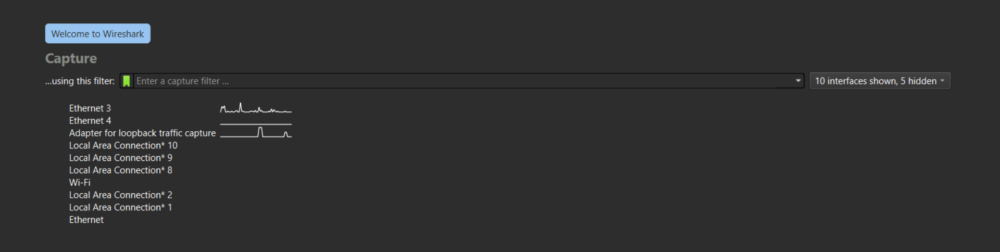
     
  * **1. Saved Wireshark Files:**

    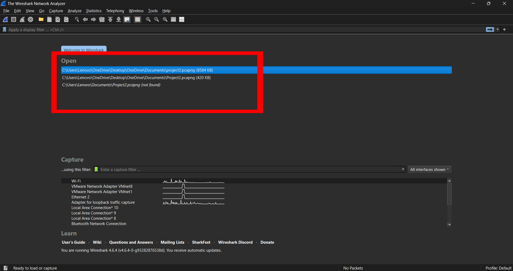
    * After, successfully Capturing & Saving your file.
    * Your file will display Here Above.
    * $$\color{orange}{\text{If you don't have any saved file there will be no Open section in your first page, Like below image.}}$$
    
  * **2. The Capture Filter Bar:**
 
    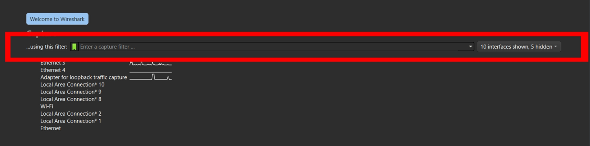
     * you can start $$\color{orange}{\text{Filtering}}$$ before $$\color{orange}{\text{Capturing packets}}$$
     * | Feature | Capture Filters | Display Filters |
       | :--- | :--- | :--- |
       | When it's applied | Before you start capturing. | During or after the capture. |
       | Syntax |	BPF (Berkeley Packet Filter)	| Wireshark Display Syntax |
       | Primary Purpose	| Save disk space & memory.	| Visually analyze and sort captured data. |
       | Effect on Data |	$$\color{orange}{\text{Permanent.}}$$ Unmatched packets are discarded. |	$$\color{orange}{\text{Temporary.}}$$ Unmatched packets are just hidden. |
       | Example Syntax	| <code>host 192.168.1.5 and port 80</code> |	<code>ip.addr == 192.168.1.5 && tcp.port == 80</code> |

  * **3. NICs (Network Interface Cards):**
     
     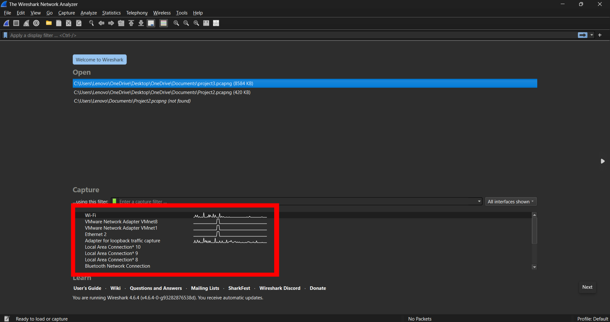
     * ? Which Network Interface Cards are picking up traffic ?
    
     * --> The one with graphs
     * you have to be Connected to the Networks with your Device, that you want to look at.
     * Generally, you are going to look at your Ethernet or Wifi.
     * Double click on, one of this to Open next page.
       
* **$$\color{red}{\text{Page-2: Capturing packets}}$$**
  
  * Double-click **==>** <code>NICs / Wifi</code>
     
    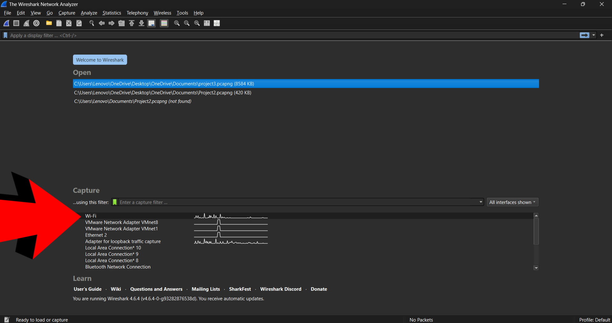

  * After clicking
    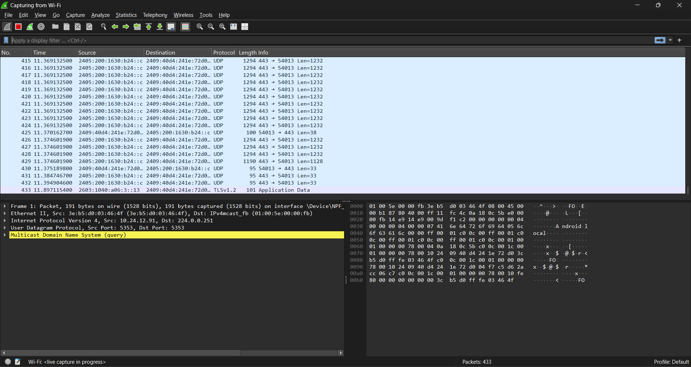
    * When we double-click, Immediately wireshark starts capturing packets & We can let it go & Capture packets for as long as we like.
    * So, If you're troubleshooting a particular website or Something like that, You wonna to try & Acess that website now while it's capturing.
       
  * & Then once you think you have enough data, Once enough time has gone by, You can click on $$\color{red}{\text{Red Square Button}}$$ up here at the top left.
    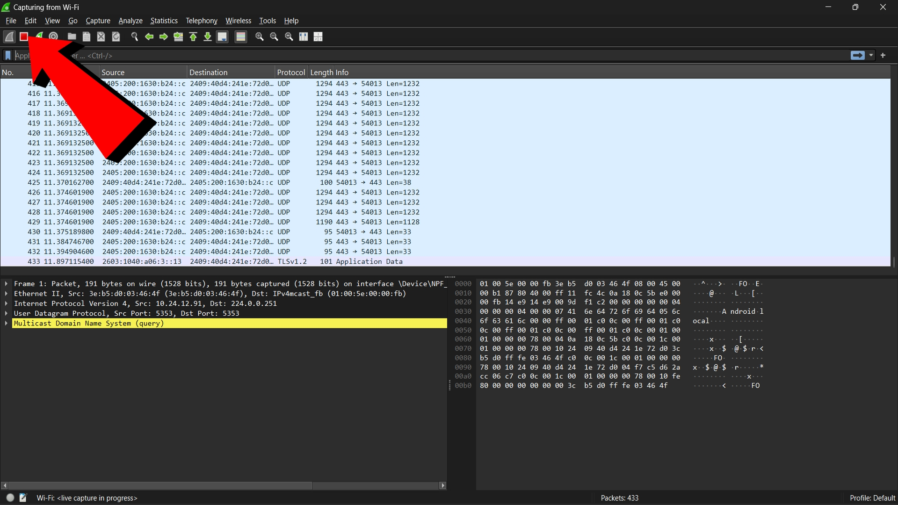

  * you can see at the very bottom of the screen here, It tells us that it captured 433 packets
    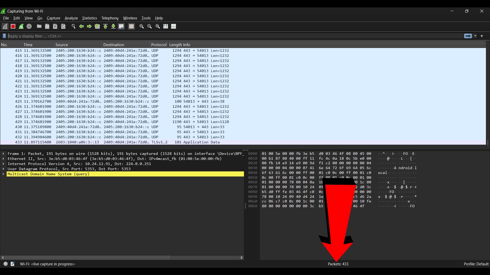
  
  * If we click the $$\color{red}{\text{Red Square Button,}}$$ it will stop capturing & Start Displaying.
    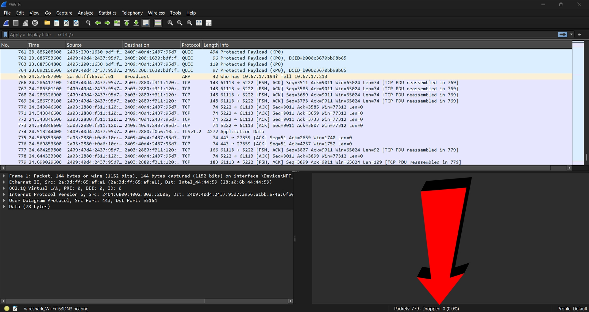
    * no. of packets captured successfully = 100% - Dropped
      
  * **1. What is a packet ?**
 
    --> Each of the rows that you see on the screen here Is a $$\color{orange}{\text{single "Packet"}}$$ of information.
    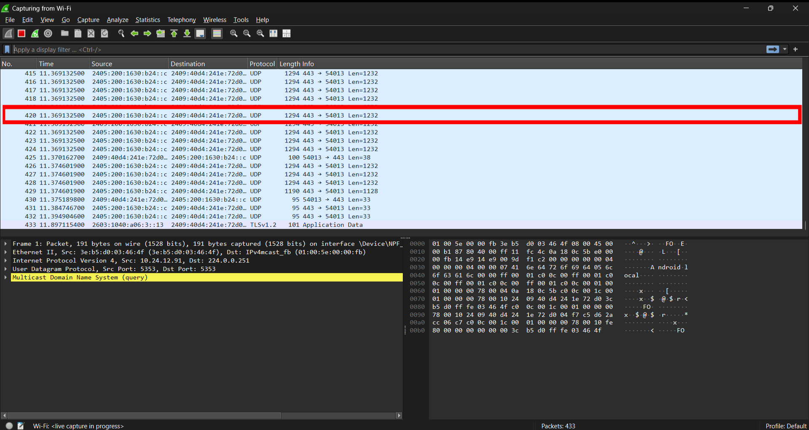
    * Whenever information is transferred over a network, It's transferred via packets.
    * That means that every time you load a webpage, Every time you upload or download something, Packets of information are being transferred between you computer & A web server.

  * **2. Right-click Filtering**

    * $$\color{orange}{\text{you can do that from anywhere in Wireshark}}$$ <code>right-click / Apply as Filter</code>
    
      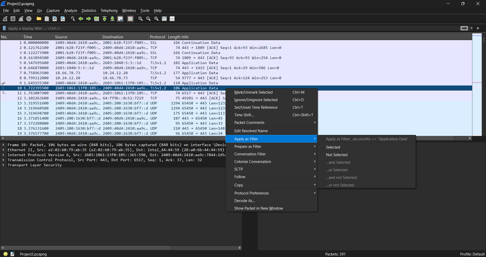
  
    * also on which column you <code>right-click / Apply as Filter / Suggest a filter as per column on which you click</code>
    
      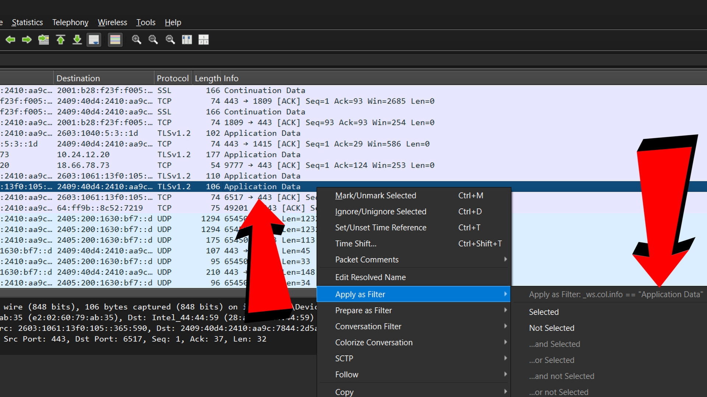
  
    * $$\color{orange}{\text{right-click(Single packet) = There's a lot of valuable options from there}}$$

  * **3. Filtering HTTPs (secure) traffic**
 
    * How can we look at secure traffic ?
    * --> by typing <code>https</code> inside Filter bar
      
      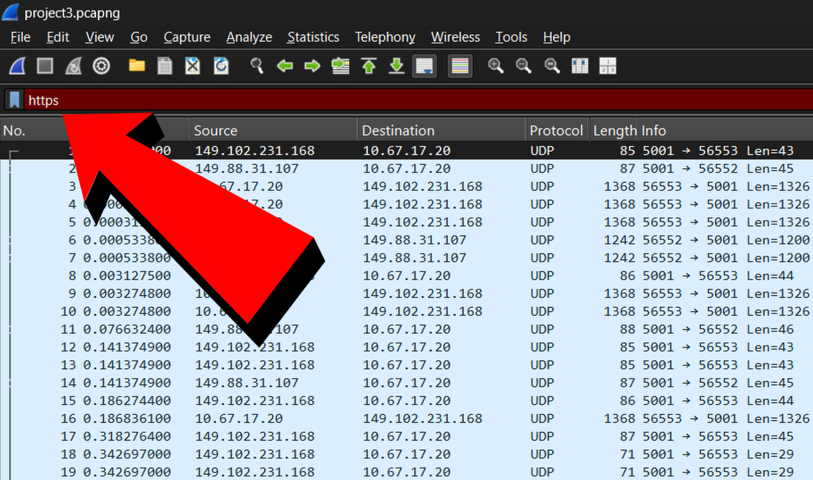
      * $$\color{red}{\text{Red line}}$$ == $$\color{red}{\text{Wrong,}}$$ means incorrect filter.
      * We actually have to use TCP, but a specific port & that's usually <code>port 80</code>.
      * it can also be port like <code>8000</code>, <code>8001</code> & <code>8002</code>.
      * generally <code>port 80</code> for HTTPs.
        
        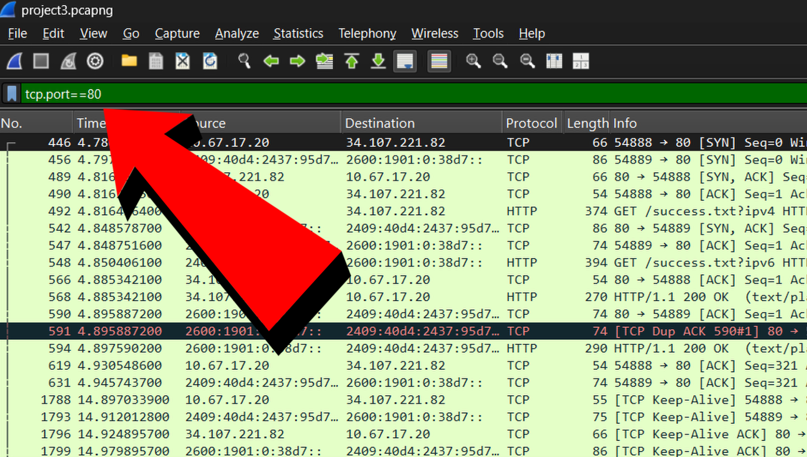
        * $$\color{green}{\text{Green line}}$$ == $$\color{green}{\text{Correct,}}$$ means correct filter.
        * this will show you all of the packets that where sent on TCP <code>port 80</code>, $$\color{orange}{\text{aka encrypted traffic.}}$$

      * When we start to look at the $$\color{orange}{\text{actual data within these packets,}}$$ we can't read it because it's encrypted.
        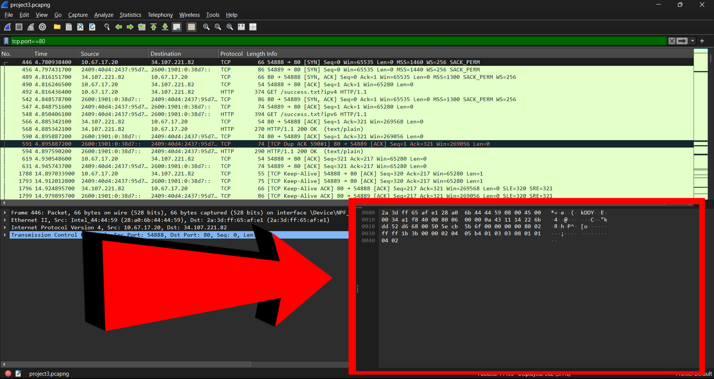
        * Now, if you had the encryption key, you can actually upload that in here to wireshark & you can decrypt it.

  * **4. Buttons**
 
    * So we did this filter <code>tcp.port==80</code> previously to show all the traffic on port 80.
    * What we can do is instead of having to type that every time, we can go over here to the right side of the screen & click on the plus icon.      
      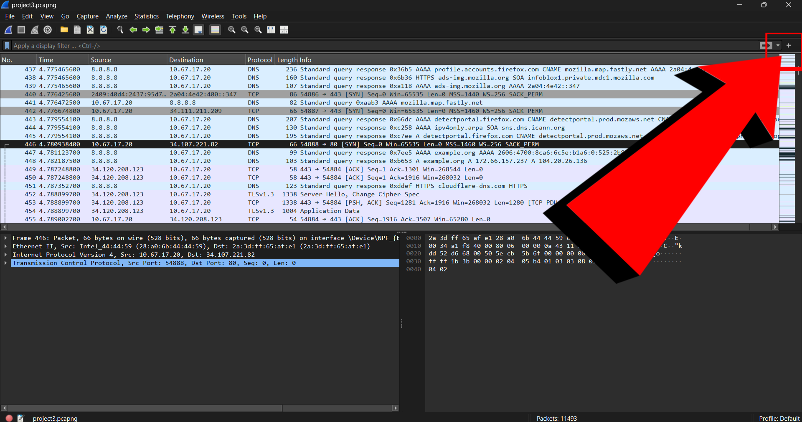
      * Now, it allows us to create a filter Button so instead of typing <code>tcp.port==80</code> this, We can just click on this Button.
   
        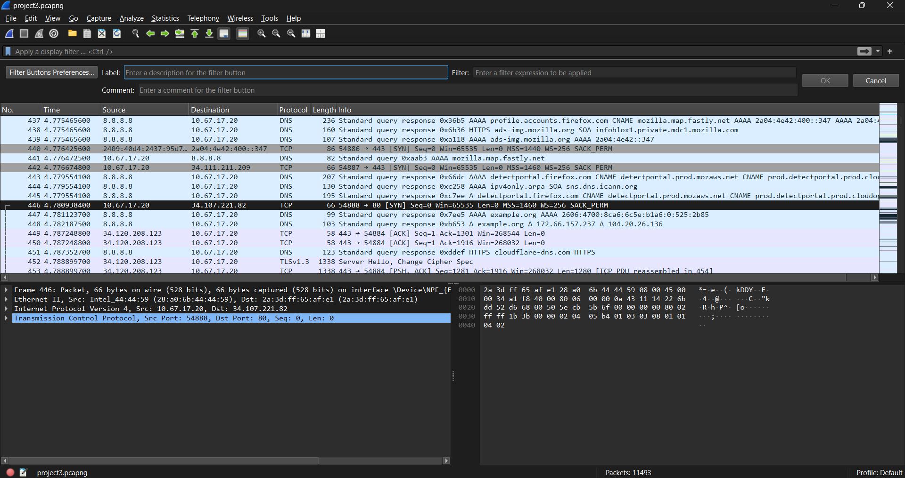
      * $$\color{orange}{\text{Label:}}$$ HTTPs(you can name it anything)
      * $$\color{orange}{\text{Filter:}}$$ tcp.port==80(automically, if some filter was already in filter bar)
      * $$\color{orange}{\text{Comment:}}$$ keep it empty
        
    * Hit $$\color{orange}{\text{ok}}$$ right below plus icon
      
      * Now, we have this nice $$\color{orange}{\text{HTTPs button}}$$ near plus icon.
      * click $$\color{orange}{\text{HTTPs button}}$$ == auto filled the filter( <code>tcp.port==80</code> ).
        

  * **5. Colors**
    * Notice on the right side of the screen(near scroll bar), We can see the coloring as well.
      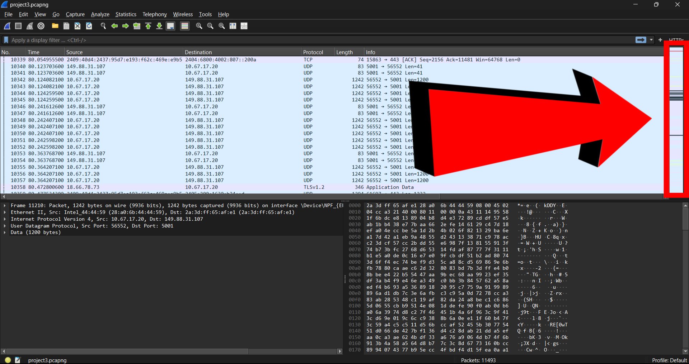
      * So these are things that Wireshark is highlighting.
      * It's an analysis toll.
      * So it's captures the information, Which a lot of different tools can do.
      * plus **+**
      * Wireshark runs it's own analysis on that information & that's where these colored lines come through.
      * This $$\color{red}{\text{Red}}$$ ones & Black ones, Wireshark is saying, $$\color{orange}{\text{"Hey, there might be something here."}}$$
      * It's not like, $$\color{orange}{\text{"Hey, this is guaranteed}}$$ $$\color{red}{\text{Malware.}}$$

    * So, we can see we've got maybe some **$$\color{red}{\text{Spurious Retransmission.}}$$**
      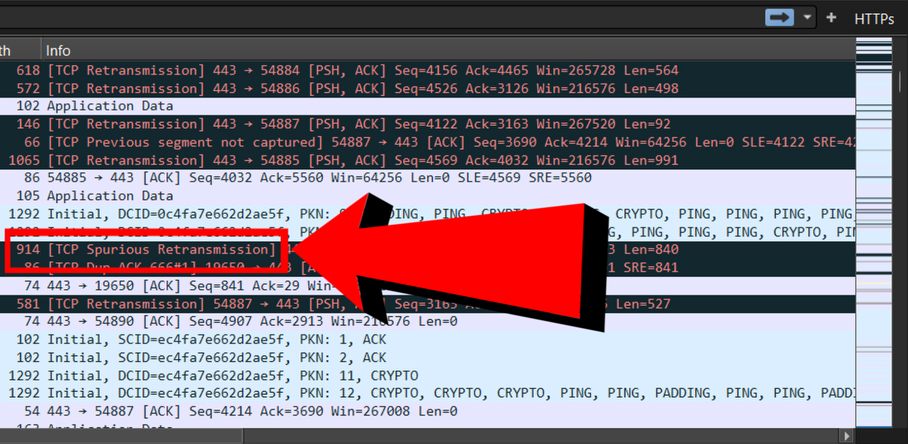
      * An unnecessary TCP packet retransmission occuring when a $$\color{orange}{\text{Sender}}$$ transmits a segment again, even though the $$\color{orange}{\text{Receiver}}$$ has already acknowledge $$\color{orange}{\text{(ACK)}}$$ the orginal data.
      * This often happens at the beginning of a capture. You'll notice as the capture went on it kind of $$\color{red}{\text{stop.}}$$

  * **6. Filtering HTTP**

    * In your filter just type <code>HTTP</code>

      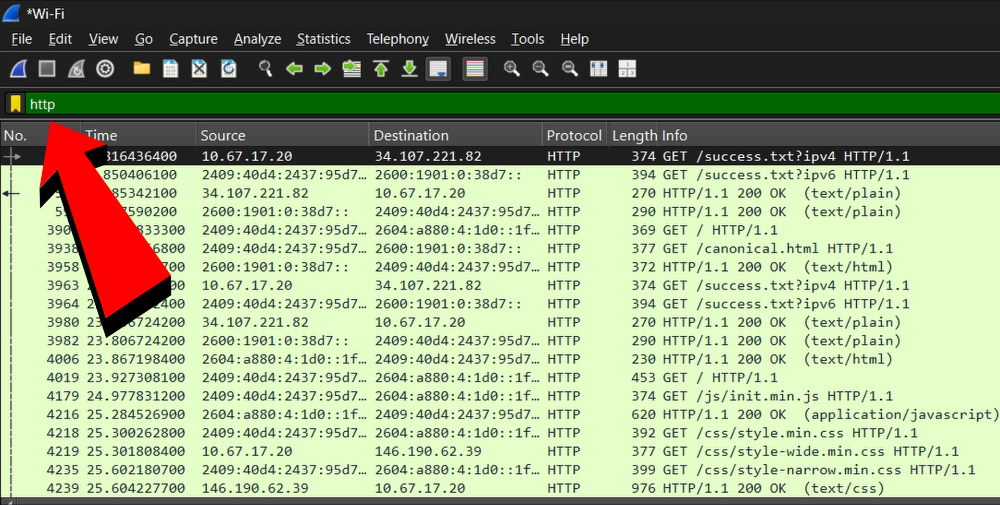
      * You'll notice when it turns $$\color{green}{\text{green}}$$ , it means that it is an accepted equation filter.
      * If it's $$\color{red}{\text{red}}$$ , it's not going to work.

  * **7. Viewing Packet Contents**

    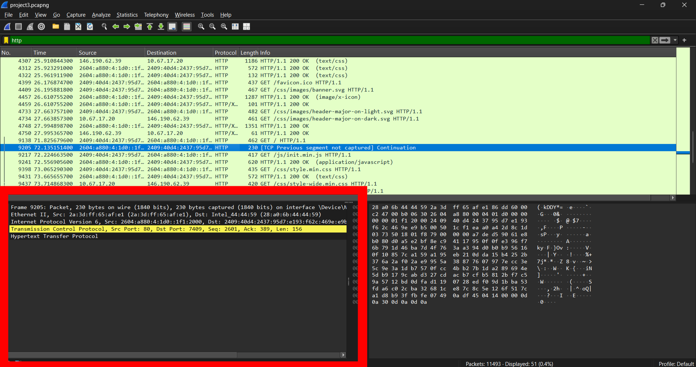
    * We have got Ethernet, TCP, IPv4, & HTTP
    * $$\color{orange}{\text{Wireshark kind of highlights, things that you might find intresting.}}$$
  
* **$$\color{red}{\text{Page-3: Viewing Entire Stream}}$$**

  * right-click on **==>** <code> Single-packet / Follow / HTTP Stream</code>

    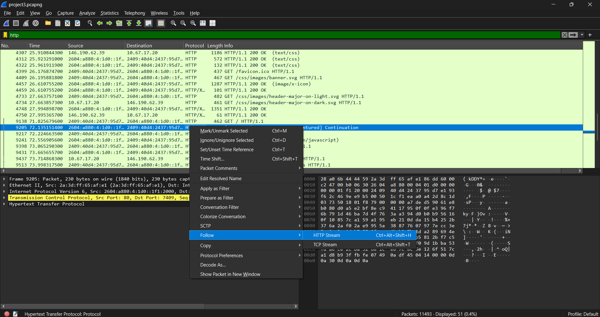

  * After clicking
    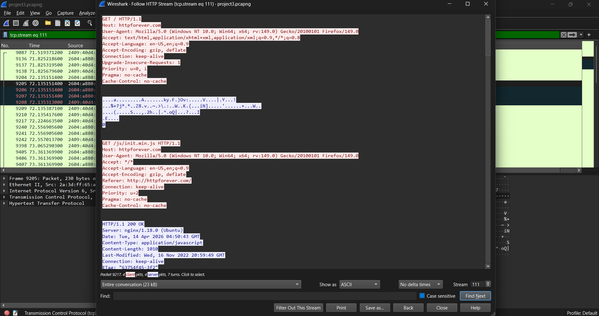
     
    * **Viewing insecure data**
      1. if you were looking at a packet sent over an encrypted connection, you could'nt really be able to read anything.
      2. We have this Entire Web page.
      3. $$\color{orange}{\text{This is the web page I went to while Wireshark is capturing.}}$$
      4. It's here in wireshark now.
      5. I could put this into a HTML compiler, & it would print out the Web page.
    * **This is How Phishing works.**
      1. Somebody sends you a link that maybe looks like your Bank link or a Social media link.
      2. So you enter your username & password.
      3. That person who's phishing you now can go in here to wireshark if they're Tapped into the network.
      4. They can see your username & password that you entered right here in Wireshark.

* **$$\color{red}{\text{Page-4: Bird's eye view}}$$**

  * Go inside **==>** <code>Statistics / Conversations</code>
  
    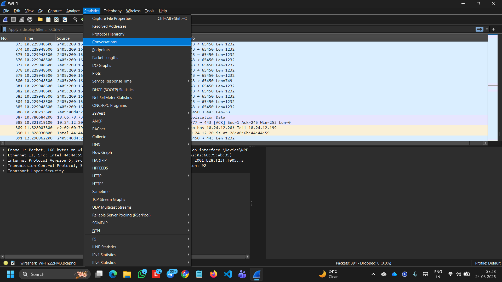

  * We have some tabs up here, <code>Ethernet . 1</code>, <code>IPv4 . 3</code>, <code>...</code> and so on, To go through the different protocols.

    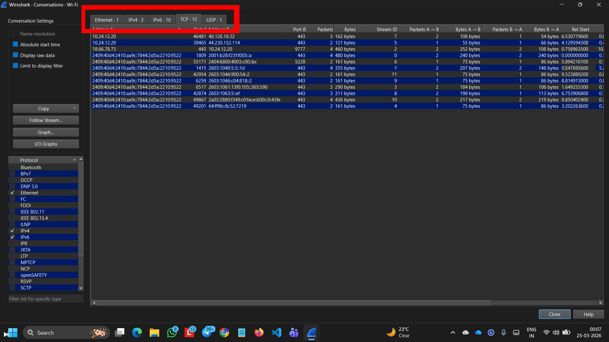
    * View of everything going on in wireshark. But, We actually use this screen to start $$\color{orange}{\text{filtering our packets.}}$$
    * Any time you're doing network analysis, It's a good idea to know some of the IP addresses on your network.
    * Settings / Network & internet / Wifi / "your Wifi name"
    
  * Scroll down to <code>IPv4</code> address = IP address of your PC

    \
    * If there's a particular device that you're trying to troubleshoot, It's a good to know maybe the Mac address of that device.
    * So I have my IP address ( <code>10.24.12.20</code> ) & I want to find where it's in this <code>Address A</code>
    
  * $$\color{orange}{\text{right-click}}$$ on your IP address/Apply as Filter/Selected/A <--> Any
    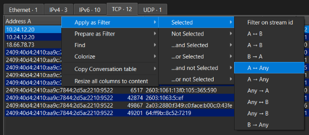\
    * A is either sending or receiving from any IP address. So when I click on this

  * you'll notice that a filter is now automatically put here in the top $$\color{green}{\text{Green line}}$$
    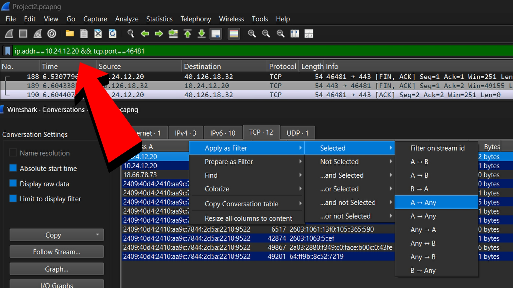

  * because we have click on <code>Port A(column)/46481</code> the filter($$\color{green}{\text{Green line}}$$) include the port( <code>&& tcp.port==46481</code> )

    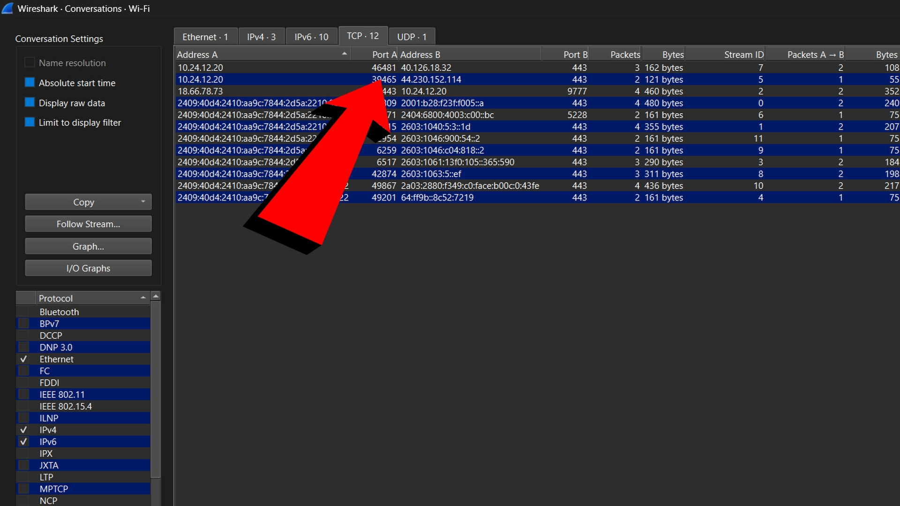

* **$$\color{red}{\text{Page-5: Coloring rules}}$$**

  * Go inside **==>** <code>View / Coloring Rules...</code>.
    
    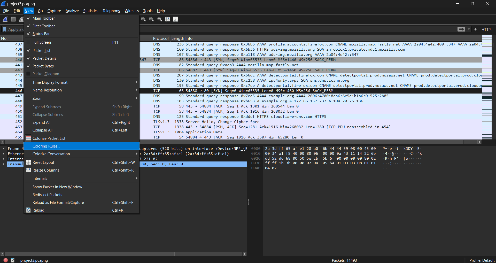

  * Here you can see & modify if you want to, all of the coloring rules.
    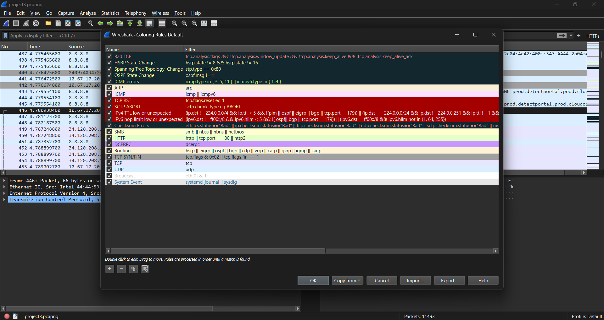

* **$$\color{red}{\text{Page-6: Packet diagram}}$$**

  * Go inside **==>** <code>Edit / Preferences...</code>

    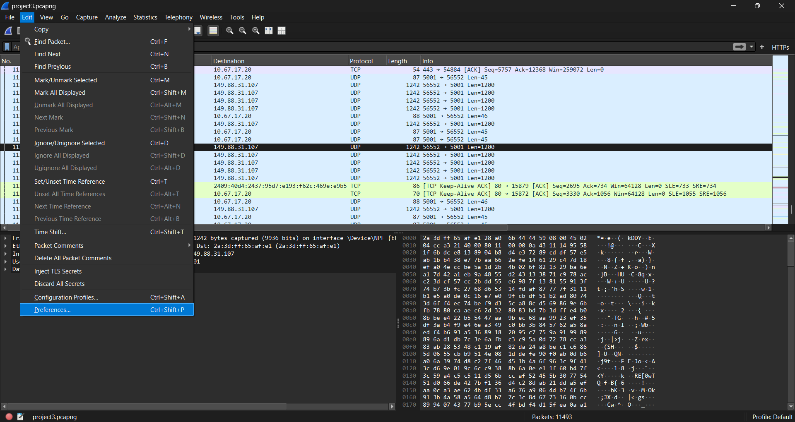

  * Go inside **==>** <code>Appearance / Layout</code>
  
    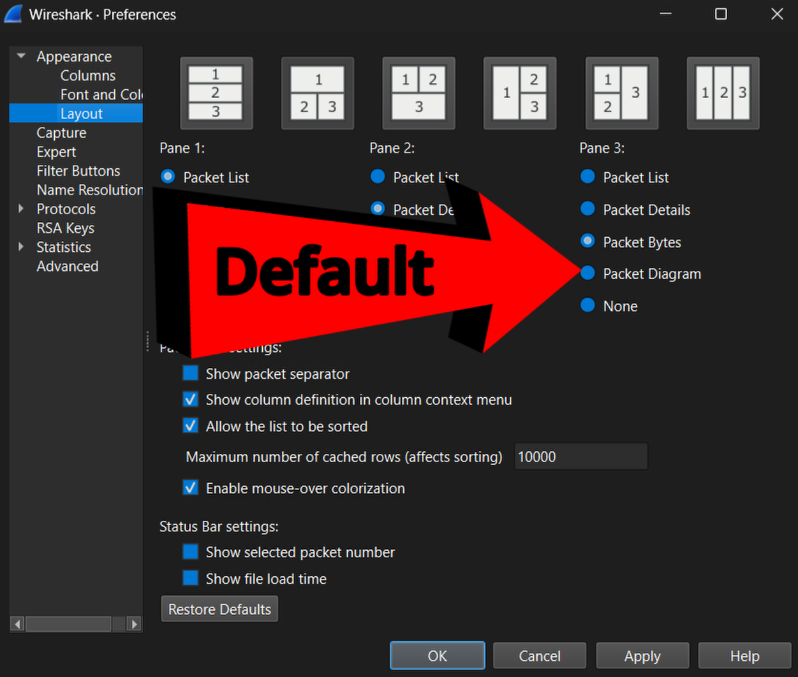

  * One thing that is kind of newer feature of Wireshark that people like to see sometimes.
    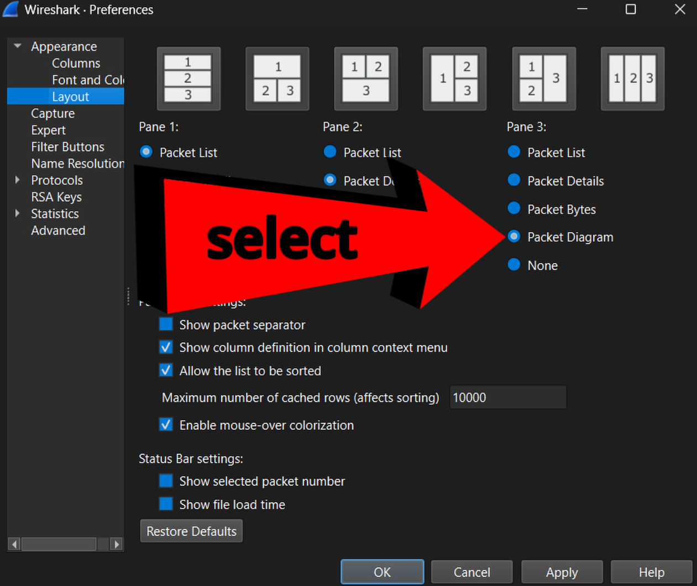
    * click <code>ok</code> to apply the changes. 

  * You can see how this packet is structured, really good for $$\color{orange}{\text{Educational}}$$ purposes.
    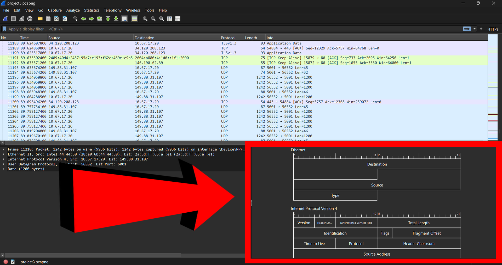
    * You can see the actual structure  of the packet, How many bytes it is, How the bytes are structured.

* **$$\color{red}{\text{Page-7: Delta time}}$$**

  * Go inside **==>** <code>Edit / Preferences...</code>

    

  * Go inside **==>** <code>Appearance / Columns</code>

    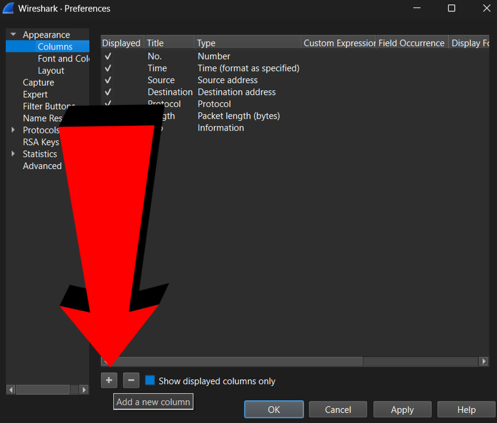
    * New line will appear
    * Double-click on New column(inside Title) to rename it (Delta)
    * Double-click on Custom(inside Type) & select (Delta time)
   
  * click <code>ok</code> to apply the changes.
    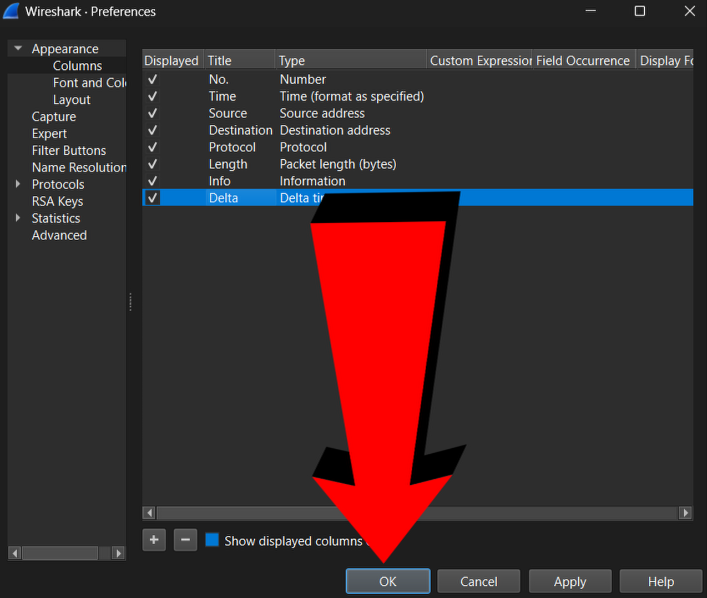
    * you can also drag & drop to change it's position(in columns)
      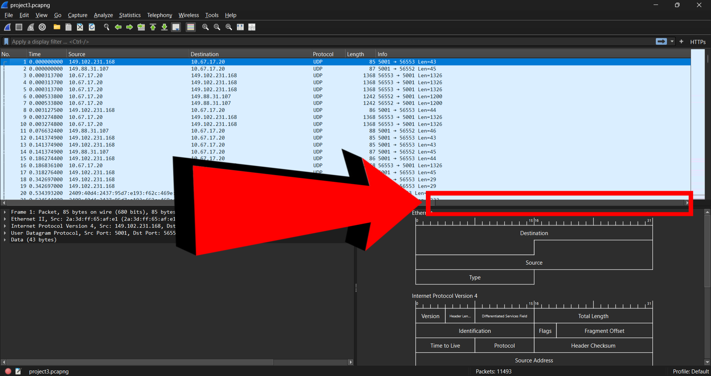

# What to look for ?

  * Generally:
      1. Look & see if your computer, is having any long conversations with an unknown device.
      2. try to discover what is the purpose of the communication is or what device it's trying to communicate with.
      3. you might want to look at HTTP & not encrypted level HTTPs.
      4. $$\color{red}{\text{Red}}$$ & Black Color packets, If you're looking for something on any network, these are good places to start.
        
  * ex 1: $$\color{orange}{\text{Device Not Connecting}}$$
    a device not working on your network, & maybe you can use Wireshark to see if there's any communication at all.
    
  * ex 2: $$\color{orange}{\text{Phishing Investigation}}$$
    may be someone at your organization think they have been phished, So you want to reopen the link that they got in the sketchy email while capturing with Wireshark, obviously on a safe machine, to see what information can be gathered.
     
  * ex 3: $$\color{orange}{\text{Increase Bandwidth}}$$
    maybe just to see what devices are canstantly communicating on your network to see if you can improve your bandwidth.

  * Wireshark can help with all of these situations, but the filters that you use & the packets that you focus on will be different.
